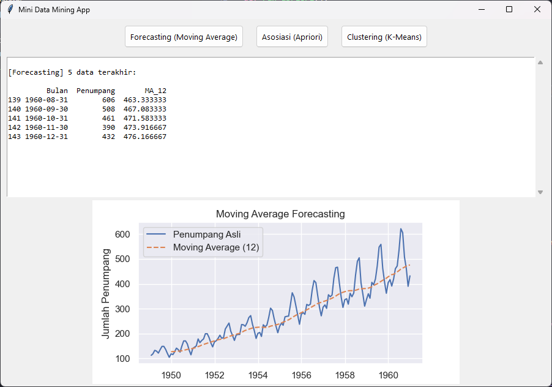

# 🧠 Mini Data Mining App with Python (GUI + Visual)

Sebuah aplikasi desktop sederhana berbasis Python dan Tkinter untuk demonstrasi tugas **Data Mining** yang terdiri dari tiga metode populer:

1. 📈 **Forecasting (Moving Average)**
2. 🔗 **Association Rule (Apriori Algorithm)**
3. 🧬 **Clustering (K-Means)**

Dilengkapi dengan antarmuka pengguna (UI) interaktif dan visualisasi data secara langsung!

---

## 🎯 Fitur Aplikasi

✅ Antarmuka berbasis GUI (Tkinter)  
✅ Pilih metode dan jalankan langsung  
✅ Output ditampilkan secara rapi (teks + grafik)  
✅ Tidak butuh koneksi internet (dataset lokal/dibuat otomatis)  
✅ Cocok untuk pembelajaran dan demonstrasi tugas kuliah

---

## 🛠️ Cara Menjalankan

### 📦 1. Instalasi Library

Pastikan kamu sudah menginstall Python (minimal versi 3.9).  
Kemudian install dependensi berikut:

```bash
pip install matplotlib pandas scikit-learn mlxtend statsmodels
```

### ▶️ 2. Jalankan Program

```bash
python data_mining_app.py
```

---

## 📚 Penjelasan Fitur

### 1. 📈 Forecasting – Moving Average
Menggunakan dataset klasik jumlah penumpang pesawat (`AirPassengers`) untuk memprediksi tren tahunan dengan metode Moving Average.

### 2. 🔗 Apriori – Association Rules
Menganalisis transaksi toko untuk menemukan aturan asosiasi menggunakan algoritma Apriori. Aturan ditampilkan dengan confidence dan lift.

### 3. 🧬 K-Means Clustering
Menggunakan dataset **Iris** dari `sklearn` untuk mengelompokkan data bunga ke dalam 3 cluster berdasarkan PCA 2D.

---

## 🖼️ Tampilan Aplikasi



---

## 📁 Struktur File

```plaintext
├── data_mining_app.py       # File utama GUI
├── data_airpassengers.csv   # (Opsional) Dataset forecasting
├── data_transaksi.csv       # (Opsional) Dataset transaksi
├── data_iris.csv            # (Opsional) Dataset clustering
└── README.md                # Dokumentasi ini
```

---

## ✨ Catatan Pengembangan

- Aplikasi ini mudah dikembangkan lebih lanjut, misalnya:
  - Menambahkan opsi input file CSV sendiri
  - Menampilkan metrik evaluasi atau cluster centroid
  - Menyimpan hasil output atau visualisasi

---

## 👨‍💻 Dibuat Oleh

> Nama: **Nando Febiono**  
> Mata Kuliah: Data Mining  

---

## 🧠 Lisensi

Proyek ini dibuat untuk keperluan pembelajaran dan tugas akademik. Bebas dimodifikasi dan dikembangkan sesuai kebutuhan.
